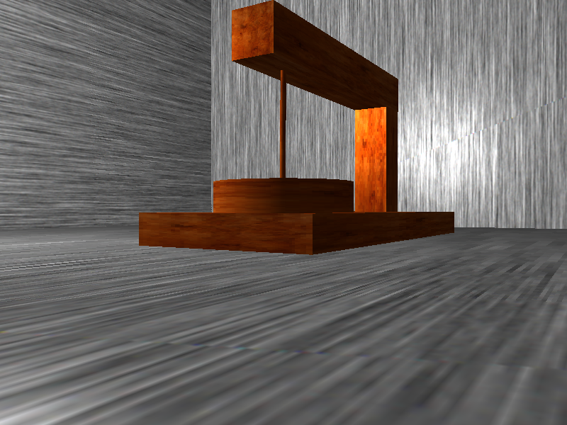
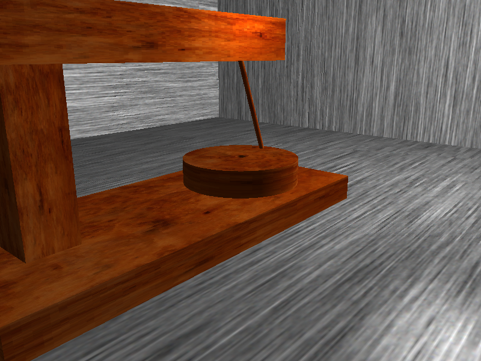
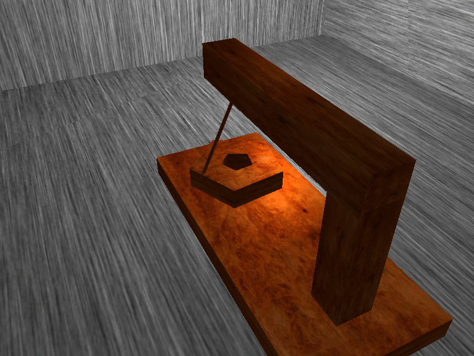
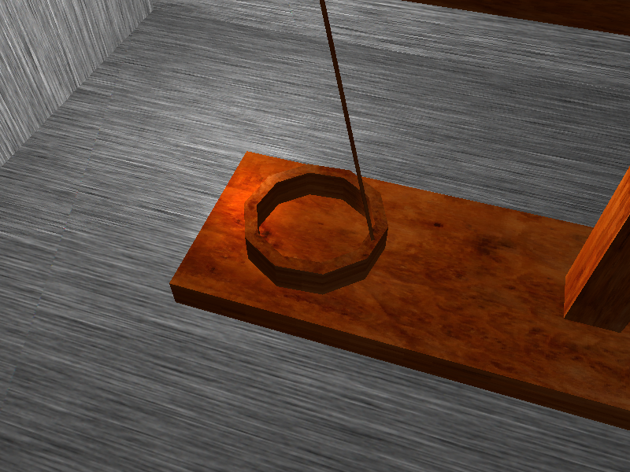

# GKOM Quern in OpenGL
Procedurally generated quern in pure OpenGL. Some captures:

[Movie from simulation](https://www.dropbox.com/s/wk8fc73tpwwr2ui/Tomasz%20Galecki%20OPENGL%20project%2014.01.2018%2017_11_10.mp4?dl=0)

